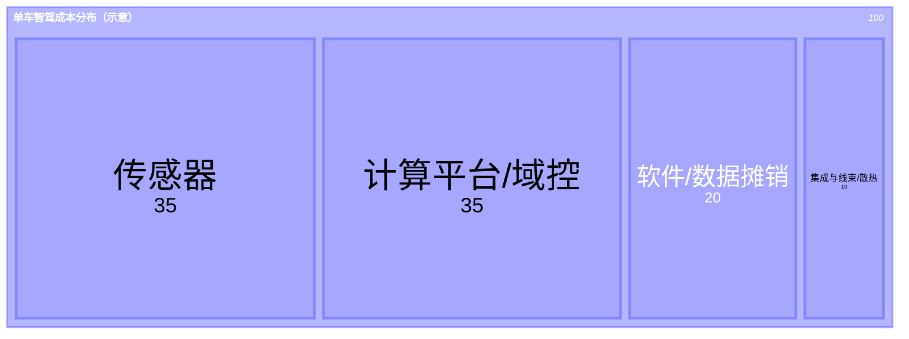

# 智驾梳理（精简版）

来源：`source/现在可以买智驾车了.md`

---

## 1）智驾 5 个阶段（阶段: 方案）

- 阶段1：多摄像头“各干各的”→ 识别后拼接（深度估计靠猜）
- 阶段2：BEV + Transformer → 多目统一到鸟瞰视角 + 时序融合
- 阶段3：占用网络（Occupancy）→ 3D 体素/网格占用预测（不必先识别类别也能避障）
- 阶段4：端到端 → 从“看见”到“操作”（两段式/一段式）+ 规则兜底/安全边界
- 阶段5：世界模型 → “脑内仿真”预测未来（反事实推理、长时序规划、仿真补长尾）

---

## 2）主要玩家（定位 × 阶段标签）

> 说明：为避免重复，“玩家名单”只在这里出现一次；后文的“分级分类”只给口径不再重复列名。

| 玩家     | 阶段标签（按本文 5 阶段） | 定位一句话（极简）                           | 关键词                 |
| -------- | ------------------------- | -------------------------------------------- | ---------------------- |
| 华为     | 4 → 5                     | 全栈平台（芯片+算法+传感器打包），规则兜底重 | ADS；WEWA              |
| Momenta  | 4 → 5                     | 第三方算法供应商（开放兼容），数据飞轮路线   | R6（RL+世界模型+仿真） |
| 比亚迪   | A/B:4；C:2                | 垂直整合 + “天神之眼”分层                    | A/B=Momenta；C=卓驭    |
| 理想     | 4                         | 主机厂自研闭环（AD Max），软硬一体           | AD Max                 |
| 小鹏     | 4 → 5                     | 主机厂自研（端到端演进）                     | X-World                |
| 蔚来     | 5（方向明确）             | 主机厂推进世界模型方向                       | NWM                    |
| 小马     | 5（方向明确）             | 世界模型方向玩家                             | PonyWorld 2.0          |
| 零跑     | 4                         | 全域自研为主、局部合作为辅；“平权”代表       | A10；高性价比硬件下放  |
| 地平线   | 平台/芯片（不贴单一阶段） | 国产智驾芯片主力（软硬协同、成本优势）       | J6 系列                |
| 卓驭     | 2                         | 低端纯视觉方案供应商                         | 供比亚迪 C             |
| 元戎启行 | 4（交付导向）             | L4 降维做 L2+ 的供应商                       | 轻资产、适配快         |
| 轻舟智航 | 4（交付导向）             | L4 降维做 L2+ 的供应商                       | 覆盖多家车企           |

---

## 3）分级分类口径（按阶段/路线，不重复列名）

- **5（方向明确）**：以世界模型为明确演进目标/核心叙事（反事实推理、长时序规划、仿真补长尾）。
- **4（量产主战）**：端到端成为主线（两段式/一段式演进），并配规则兜底/安全边界完成量产交付。
- **2（走量纯视觉）**：以 BEV+Transformer 等为主的纯视觉走量/成本优先配置。
- **平台/芯片**：更多是算力/平台与软硬协同能力，支撑 2→4 的规模化落地，不强行贴单一阶段。

> 各玩家对应的阶段标签见上表「2）主要玩家（定位 × 阶段标签）」。

---

## 4）单车智驾成本（极简）

- 硬件：传感器（摄像头/毫米波/超声波/激光雷达）、智驾芯片/域控（算力+存储+散热）、线束与高速通信、底盘/执行接口（随 E/E 架构而变）
- 软件/工程化：数据回传→清洗标注→训练、仿真（世界模型/场景生成）、测试验证与合规、OTA 维护
- 文中量级：激光雷达成本 **<200 美元**；智驾套件约 **3000–5000 元**

### 主要成本分布（面积图｜示意）

> 说明：文章未给出精确拆分比例；下图是把“单车可见成本（BOM）+ 软件/数据摊销”做一个**典型结构示意**，用于理解钱主要花在哪些桶里（不同车型/配置会显著变化）。

解读（抓重点）：

- **硬件（传感器 + 计算平台）通常占大头**：决定了“有没有能力跑高阶功能”的下限。
- **集成成本容易被低估**：线束、散热、可靠性与工程化落地，决定量产稳定性与返工成本。
- **软件/数据摊销是长期战争**：数据闭环、训练/仿真、验证与 OTA，决定“能不能持续逼近最后 10 分”。

---

## 5）一句话

共识是“**无图 NOA + 一段式端到端**”；差异在于：**更少规则实现更高安全边界**（数据质量、仿真/世界模型与工程化深度）。
